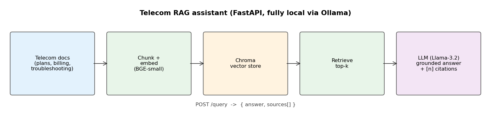
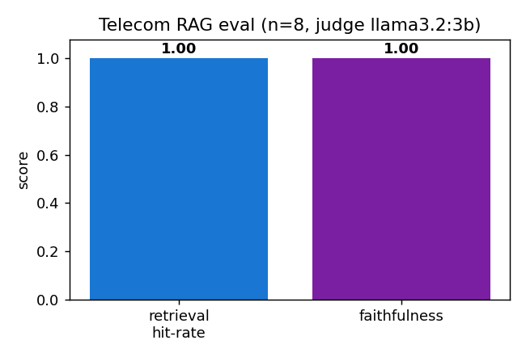

# telecom-rag-assistant

A retrieval-augmented telecom support assistant. It embeds a knowledge base (plans, billing,
troubleshooting) into a Chroma vector store, retrieves the relevant chunks for a question, and asks a
local LLM (Llama-3.2 via Ollama) to answer grounded in that context with inline `[n]` citations.
Served as a FastAPI service, and it runs fully locally — no API keys.

## How it works
Docs → chunk + embed (BGE-small) → Chroma vector store → retrieve top-k → the LLM answers using only
the retrieved context, citing sources, and refuses when the answer is not in the knowledge base.

## Run
    pip install -r requirements.txt
    ollama pull llama3.2:3b
    uvicorn src.api:app --port 8000
    # then: POST /query  { "question": "How much is the Unlimited Pro plan?" }

## Example
**Q:** How much is the Unlimited Pro plan and how many international minutes does it include?

**A:** The Unlimited Pro plan costs 50 USD/month, and it includes 300 international minutes. `[1]`
&nbsp;&nbsp;*(sources: plans.md)*

## Evaluation
A held-out eval set scores retrieval hit-rate and LLM-as-judge faithfulness:

    python src/eval.py

